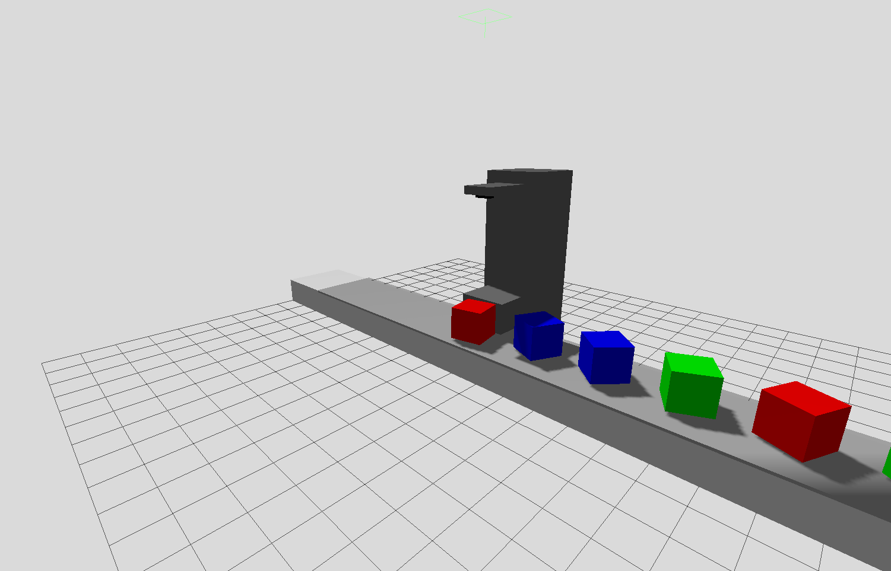

# Coveyor Sorter

## Requirements

- ROS 2 Jazzy Jalisco
*(Developed using `osrf/ros:jazzy-desktop-full` Docker image)*
- `ros_gz_sim` package
- `vision_opencv` package

## Installation

### Building from source

```sh
source /opt/ros/jazzy/setup.bash
colcon build
source install/setup.bash
```

## Usage

Launch:
```sh
ros2 launch conveyor_sorter init.launch.py
```

Spawn multiple random props and start the conveyor:
```sh
ros2 run conveyor_sorter random
```

Spawn a random prop on the conveyor:
```sh
ros2 service call /props/spawn conveyor_sorter/srv/SpawnProp
```

Start the conveyor:
```sh
ros2 service call /conveyor/start conveyor_sorter/srv/ConveyorStart
```

## Structure

### Services

- `/conveyor/start`  
  Starts the conveyor.
  - `forward`  
    Goes forward if true, backwards otherwise.
  - `speed`  
    Speed of the conveyor.
- `/conveyor/stop`  
  Stops the conveyor.
- `/pusher/push`  
  Performs a single push by the pusher.
- `/props/spawn`  
  Spawns a prop on the conveyor.
  - `random`  
    If true, chooses a prop randomly from the pool.
  - `target`  
    Sets type of the prop (if true, it will be sorted out).  
    Works only if `random` is off.


## Demo



